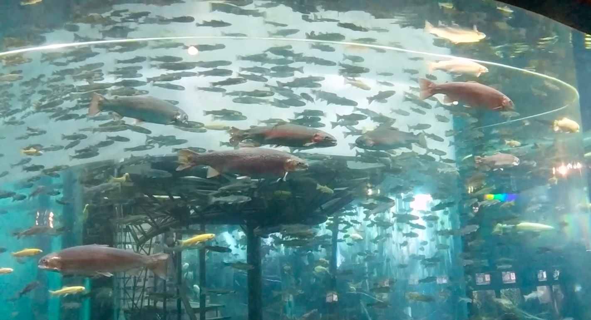

## Dive into Japan's Obsession with Fish

It's no secret that the Japanese love to eat fish. The average Japanese person consumes 23 kilograms of fish per year, as reported by [Statista](https://www.statista.com/statistics/1228351/japan-per-capita-consumption-volume-fish-seafood/#:~:text=In%20fiscal%20year%202021%2C%20the,importance%20as%20a%20food%20ingredient.). That's three times the amount consumed by their British counterparts. However, Japan's historic connection with fishing and aquaculture transcends the gastronomic pleasure of sushi and sashimi. With a commitment to sustainability and increasingly innovative methods of fish farming, their love for fish persists.

Before we talk about aquariums, let's focus on zoos. Japan boasts a significant proportion of zoos globally, ranking 5th in the world for the "most zoos," according to [World Population Review](https://worldpopulationreview.com/country-rankings/zoos-by-country). Traveling around Japan, one might be surprised to stumble upon towns with free, government-run zoos. These zoos were initially established as symbols of progress, with the first emerging in Ueno Park during the Meiji Restoration period. Symbolizing wealth and representing an advancement in educational museums, zoos proliferated across Japan with little regard for animal welfare. The emergence of aquariums served as a natural extension of this educational and decorative use of animals.

Japan holds the record for the highest number of aquariums per capita, as documented on [Wikipedia](https://en.wikipedia.org/wiki/List_of_aquaria_in_Japan#cite_note-:1-1). Notably, Tokyo boasts nine distinct aquariums. The Osaka Aquarium Kaiyukan stands out with a single tank housing three whale sharks. Often, aquariums in Japan are integrated into shopping centers, collaborating with prominent Japanese brands such as the DMM Aquarium or the Maxell Aqua Park. It's commonplace to encounter large aquariums at the entrances of major malls.

Japan even boasts aquascaping celebrities like Takashi Amano, a pioneer of the natural aquascape style of fish tank. Aquariums worldwide still showcase exhibits featuring tanks designed by the Aqua Design Amano company. Amano also introduced a type of shrimp into the hobby known now as "Amano shrimp" for their ability to maintain tank cleanliness, a designation honoring his contribution.

Beyond their educational and conservation roles, aquariums permeate pop culture. Romantic anime often feature the stereotype of an aquarium date, as discussed in a [CBR article](https://www.cbr.com/how-aquarium-dates-became-a-romantic-anime-staple/). While a beach might be a traditional setting for a date, some city-located anime opt for aquariums to showcase Japan's affinity for the ocean and provide characters with a visually stunning backdrop for connection. Films like 2019's "Tuna Girl" revolve around fish farming, following a clumsy aquaculture student working on Japan's first inland tuna hatchery.

While I could recommend the best Japanese aquariums, I will instead highlight some of the most unique and strange. I recognize the irony in admiring aquatic life whilst suggesting visits to an aquarium, and in some cases below this cruelty becomes increasingly stark. I've ordered the below from modern and spacious all the way to a museum for dolphin fishing, so go as deep as you care to.

### Gifu World Freshwater Aquarium - Gifu City

You will perhaps notice a pattern. Many aquariums here have an additional focus on local, freshwater fish. Gifu World Freshwater Aquarium is the gold star, the world's largest freshwater-focused aquarium. When we visited, there was a special exhibit on Japanese frogs and toads.

### Yamanashi Prefectural Fuji-yuusui-no-sato & Mori-no-naka Aquarium - Oshino

The name is a bit better in Japanese. This aquarium uses Mt. Fuji run-off water to fill its tanks. The focus is on Carp, Salmon, and Sturgeon, so if you like the typical fish you catch fishing in the West, this is for you.

I really recommend this place, not only for the aquarium but because the town itself is famous for the 8 ponds that were used in pilgrimages to Mt. Fuji. They are now stocked with fish and are a really unique tourist destination.

### Sumida Aquarium - Tokyo

If your trip takes you only to the big cities, and you have a packed schedule, then Sumida Aquarium is the one for you. It offers the standards of a Japanese aquarium: penguins, tropical fish, and garden eels.

The real highlights here are the natural aquascape tanks. These tanks are designed by the above-mentioned ADA company. At the time of creation, they were the world's largest natural aquascape tanks, as detailed in [ADA's report](https://www.adana.co.jp/en/aquajournal/sumida_aquarium_report_08/). These tanks emulate a terrestrial grassland, peppered with shrimp and neon tetras. It is personally my favorite tank.

Beyond this, they also have a large exhibit on the selective breeding of goldfish, evolving from brown to a subtle shine, all the way up to the colors and patterns we now associate with goldfish and carp.

### Tokyo Sea Life Park - Tokyo

If you really have spare time, or are staying near Tokyo Disneyland, add in Tokyo Sea Life Park. Designed by [Yoshio Taniguchi](https://en.wikipedia.org/wiki/Yoshio_Taniguchi), this museum does not suffer the disadvantage of Tokyo; there is ample space for a spectacular building.

The highlight tank here is the tuna tank. Few aquariums house tuna, and if they do, they are in a large tank with other attraction animals. Here, a school of tuna dash back and forth across a large loop with relaxed seating. Throughout the day, the tuna are fed, and you see just how fast they can move. It feels odd to recommend a tank clearly too small for these ocean-dwelling fish, but I think when the alternative for many is a disconnect between the food we eat and the living fish itself, there is a feeling of respect for the animal here.

Tokyo Sea Life Park has an excessive focus on local wildlife, and this extends to the Freshwater Life Center, a separate exhibit in the park around the aquarium. This area is more peaceful than the main building, and I wonder if it is often skipped. A local fish pond is encased in a wall of glass, giving a rare side-view to the beloved Koi, among other local fish.

### Inokashira Park Zoo - Mitaka City

Mitaka is a quiet town outside of Tokyo, famously visited as the host of the Studio Ghibli Museum. In the very same park is the Inokashira Park Zoo. This is one of those very old locally-run zoos I mentioned earlier. Some of the exhibits are old and concrete, and there is a shrine to the elephant that spent its whole life there. This is the first zoo I'd recommend you skip parts of, or don't go to if you are upset by poorer animal welfare.

The zoo is split into two parts: the older animal half and the more recently made aquatic half. This facility focuses on the local creatures found in the Inokashira pond.

### Hotaruika Museum - Toyama

Toyama is famous for firefly squid. On a few days each year, if the conditions are right, thousands of these squid wash up on shore and die, leaking bioluminescent algae into the water creating a blue light. That's not particularly profitable as an attraction, so instead, fishing boats offer tours out into Toyama Bay, where they catch firefly squid and make them light up.

This is highly seasonal, so check dates before you go. When I went, it was a little early, and they didn't have many firefly squid yet. The museum includes a show where they turn the lights off and raise the squids out of the water. You can also play with the firefly squid in touch pools.

### Taiji Whale Museum - Wakayama

If you've ever seen "The Cove," or any documentary focusing on dolphin fishing, you've likely seen Taiji. This is where the fishermen have historically, and continue to, hunt dolphin by driving them into the bay and killing them. The sea turns red.

If you wanted to, you can go to the Taiji Whale Museum, which is an anthropology museum in Wakayama. From here, you can see the bay where these hunts take place. As of March 2022, they hold 269 dolphins captive here. Included in your museum entry, you can walk around these enclosures. The dolphins approach cautiously and get as close as they can, almost as if trying to talk to you.

It's the land of sushi and sashimi, but it's also increasingly a land of conservation and care for the animals they love to eat. I think it's important to stay engaged with the idea that we sometimes eat or accidentally kill these animals as part of existing, and a world where that disconnect is narrower is a better place.